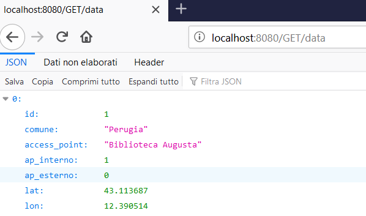

# OOP
progetto oop
Il seguente file README.md andrà a spiegare le funzionalità dell'applicazione creata. In particolare essa è un'applicazione REST, progettata in Java e con l'aiuto di Spring-Boot Framework, la quale, preso in ingresso un FILE su cui si trovano dati in formato JSON, scarica il dataset e carica in H2 DB. Su questo DB sarà possibile effettuare operazioni per ottenere i dati richiesti in formato *JSON.

# IL DATASET
Il servizio http://umbriawifi.open-net.it/ prevede la possibilità di navigare gratuitamente in modalità wifi per due ore al giorno anche non consecutive, attraverso una semplice registrazione online.Il dataset contiene l'elenco degli hotspot UmbriaWiFi con la loro localizzazione, comprende sia i punti realizzati con il progetto UmbriaWiFi del POR-FESR 2007-2013 che quelli del progetto pilota WifiUmbria (PRJ-1202)del POR FESR 2014-2020.
Ogni riga del file contiene:
- Identificatore univoco del hotspot (indicata con "ID");
- Comune del hotspot (indicata con "COMUNE");
- Access Point del hotspot (indicata con "ACCESS_POINT");
- Access Point da interno (indicata con "AP_INTERNO");
- Access Point da esterno (indicata con "AP_ESTERNO");
- Latitudine della localizzazione (indicata con "LAT");
- Longitudine della localizzazione (indicata con "LON");

# Modellazione
Ogni riga del dataset è rappresentata da una istanza della classe Dato che contiene gli attributi elencati nel paragrafo precedente.
Nello specifico è il seguente:

