# OOP
progetto oop
Il seguente file README.md andrà a spiegare le funzionalità dell'applicazione creata. In particolare essa è un'applicazione REST, progettata in Java e con l'aiuto di Spring-Boot Framework, la quale, preso in ingresso un FILE su cui si trovano dati in formato JSON, scarica il dataset e carica in H2 DB. Su questo DB sarà possibile effettuare operazioni per ottenere i dati richiesti in formato *JSON.

# IL DATASET
Il servizio http://umbriawifi.open-net.it/ prevede la possibilità di navigare gratuitamente in modalità wifi per due ore al giorno anche non consecutive, attraverso una semplice registrazione online.Il dataset contiene l'elenco degli hotspot UmbriaWiFi con la loro localizzazione, comprende sia i punti realizzati con il progetto UmbriaWiFi del POR-FESR 2007-2013 che quelli del progetto pilota WifiUmbria (PRJ-1202)del POR FESR 2014-2020.
Ogni riga del file contiene:
- Identificatore univoco del hotspot (indicata con "ID");
- Comune del hotspot (indicata con "COMUNE");
- Access Point del hotspot (indicata con "ACCESS_POINT");
- Access Point da interno (indicata con "AP_INTERNO");
- Access Point da esterno (indicata con "AP_ESTERNO");
- Latitudine della localizzazione (indicata con "LAT");
- Longitudine della localizzazione (indicata con "LON");

# Modellazione
Ogni riga del dataset è rappresentata da una istanza della classe Dato che contiene gli attributi elencati nel paragrafo precedente.
Il dataset contiene anche alcuni elementi che non sono stati resi disponibili, tali elementi verranno perciò considerati come "NULL". Esempio di una istanza di Dato:

# Funzionalità
All'avvio, scarica il dataset, effettua il parsing del file JSON e crea gli oggetti, successivamente resta in attesa di richieste dell'utente. Utilizzando il framework Spring Boot è in grado di gestire e rispondere a richieste effettuate sul "localhost:8080" (Apache TomCat Web Server) dal browser o da qualsiasi simulatore di chiamate. I dati restituiti sono in formato "JSON" e rappresentano oggetti del dataset. È possibile chiedere anche la restituzione delle statistiche sui dati (formato JSON) che specificando l'attributo sul quale effettuare la computazione (colonna dei dati) quali:
- Numeri: 
          - avg, min, max, dev std, sum, count
- Stringhe:
          - Conteggio elementi unici (per ogni elemento unico indicando il numero di occorrenze)
          
 Su richiesta è possibile visualizzare tutti i dati, i metadati e cancellare anche un elemento fornendo l'identificatore numerico del    dato da cancellare.
 
 # Path disponibili
 - ###### /GET/metadata
 Restituisce i metadati (formato JSON) ovvero elenco degli attributi e del tipo
 
 - ###### /GET/data
 Restituisce tutti i dati (formato JSON)
 
 - ###### /GET/data/delete/{id}
 Cancella un elemento fornendo l'identificatore numerico del dato
 
 - ###### /GET/stats/{attributo}
 Restituisce statistiche sui dati (formato JSON)  che specificando l'attributo sul quale effettuare la computazione (colonna dei dati) quali:
 - NUMERI: avg, min, max, dev std, sum e count
 - Stringhe: Conteggio elementi unici (per ogni elemento unico indicare il numero di occorrenze)
 
 # Esempi di funzionamento
 - ###### /GET/metadata
 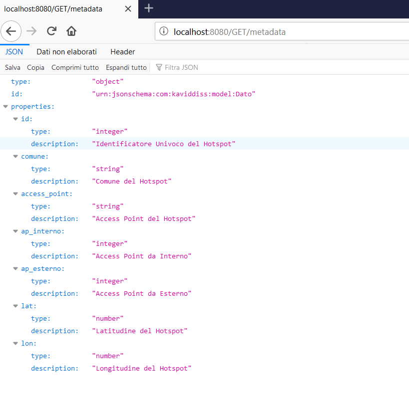
 
 ##### -----------------------------------------------------------------------------------------------------
 - ###### /GET/data
 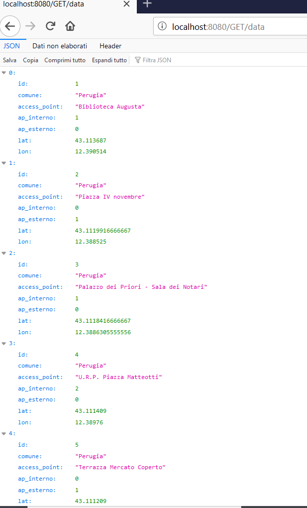
 ....
 .....
 ........
##### continuano i dati 
 
 
 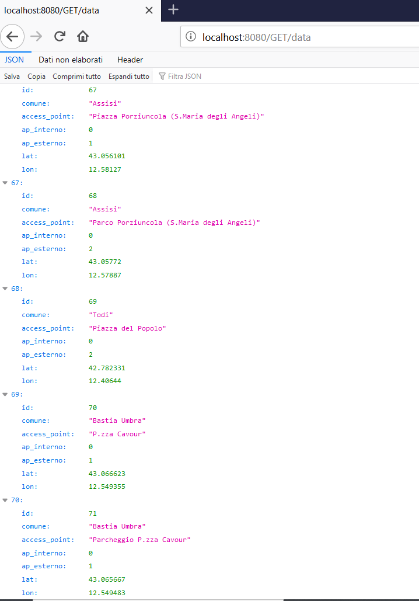
 ##### -----------------------------------------------------------------------------------------------------
 
 - ###### /GET/data/delete/{id}
 ## Prima di cancellare il dato
 
 ## Proviamo a cancellare il dato con id=1
 ###### /GET/data/delete/1
 id=1 -> il dato esiste quindi viene cancellato e comunicato tramite il messaggio
 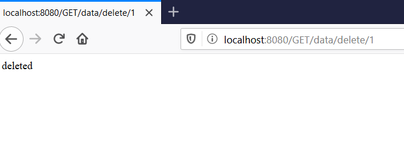
 ##### Controlliamo se il dato con id=1 è stato cancellato o no
 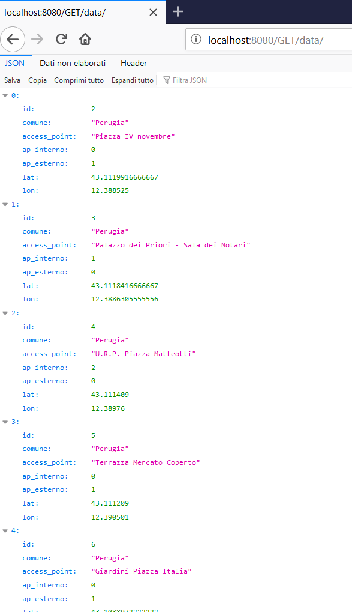
 ##### Infatti il dato con id=1 non esiste più
 
 Riproviamo con un'altro id. Scegliamo id=5
 ###### /GET/data/delete/5
 Controlliamo se è stato cancellato o no, infatti il dato con id=5 non esiste più:
 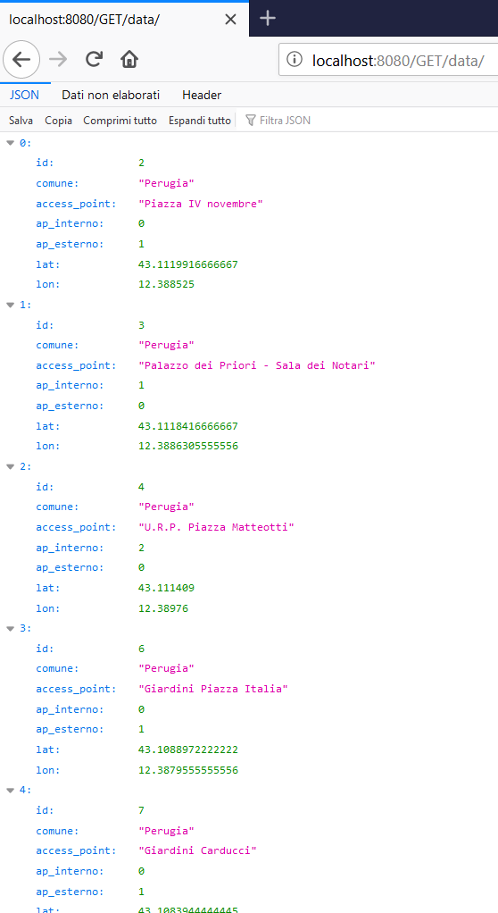
 
 ## Proviamo a cancellare un dato che non esiste-> per esempio: il dato con id=100
 ###### /GET/data/delete/100
 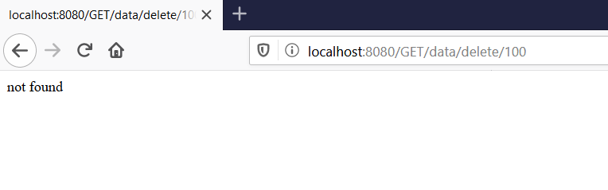
 
 ## Come ultima test, proviamo a cancellare un dato che è stato cancellato precedentemente-> per esempio: il dato con id=5
 ###### /GET/data/delete/5
 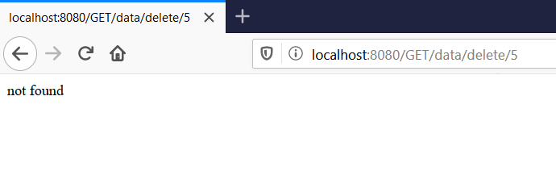
 
 ##### -----------------------------------------------------------------------------------------
 
 ##### Esempi di funzionamento per le statistiche sui dati
 - ###### Attributi numerici: "id", "ap_interno", "ap_esterno", "lat" e "long"
 - ###### Attributi stringhe: "comune" e "access_point"
 
 
 -  ###### GET/stats/{attributo}
 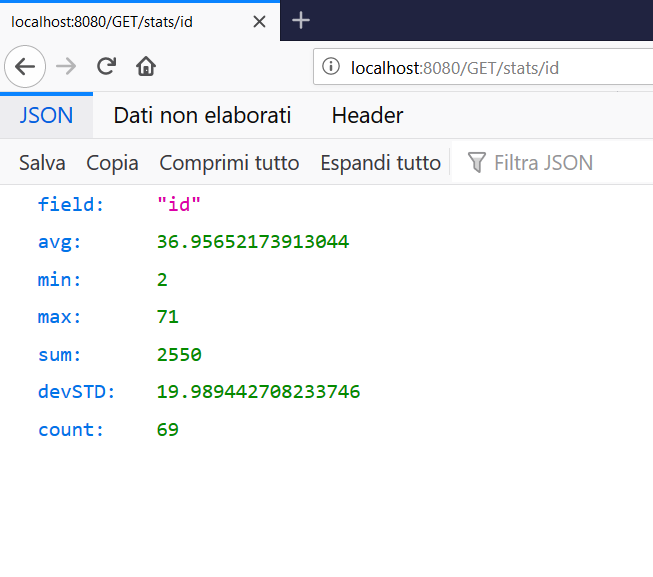
 
 
 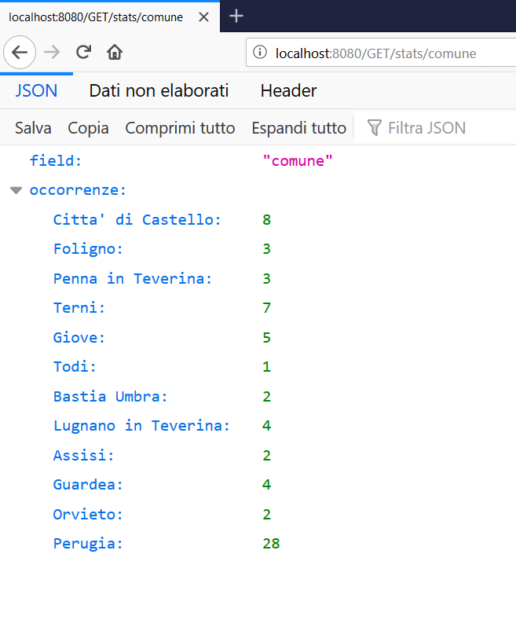
 
 
 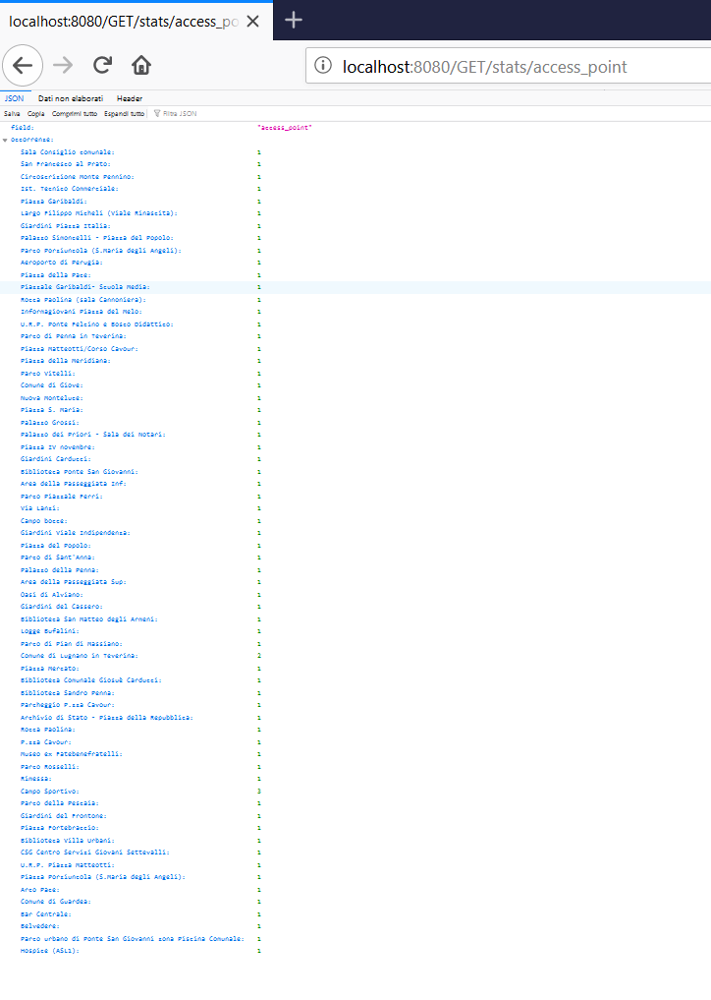
 ##### vediamo il formato dei dati con lo zoom
 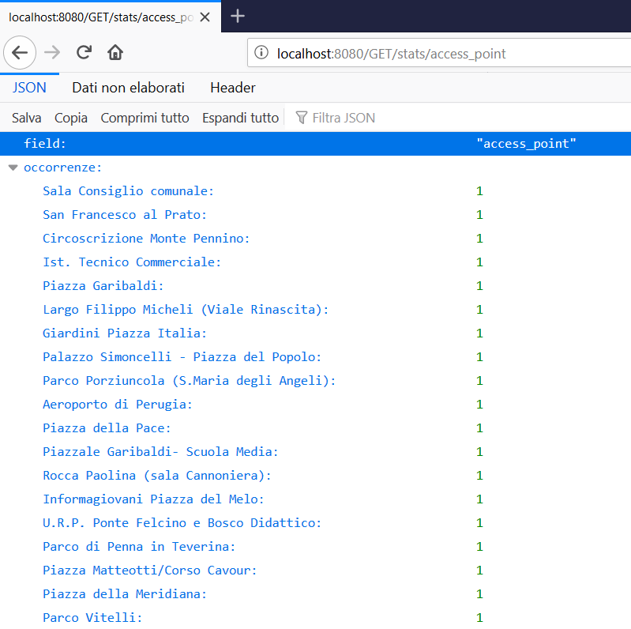
 
 
 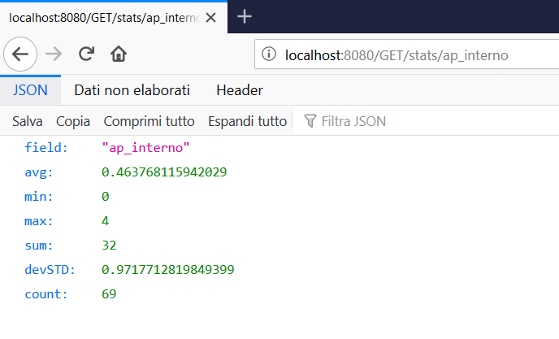
 
 
 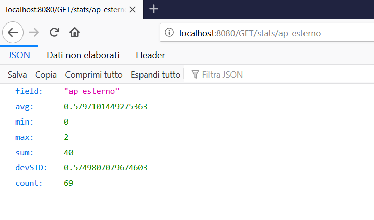
 
 
 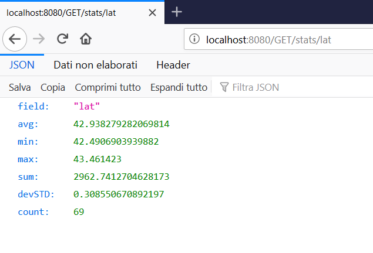
 
 
 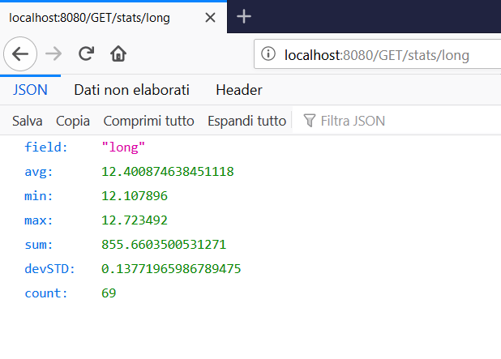
 
 #### Proviamo ad inserire un nome del attributo inesistente-> per esempio: città
 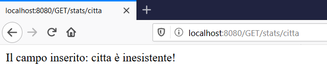
 
 # UML
 
 
 
 
 
